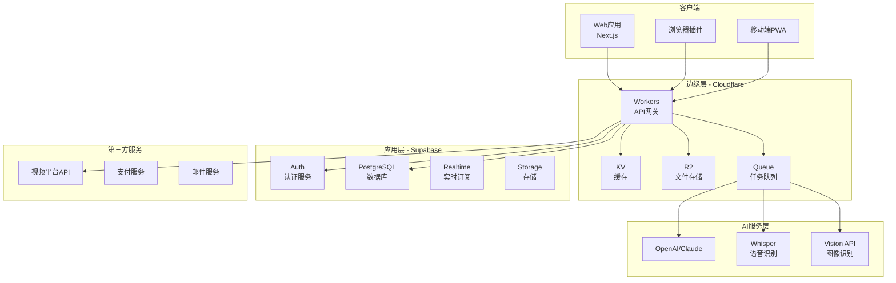
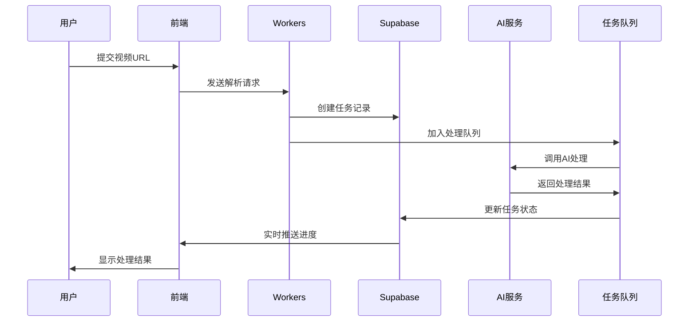

# 影海拾贝 - 产品技术需求文档 (PRD)

## 1. 产品概述

### 1.1 产品定位
**影海拾贝** 是一个智能视频内容提取与转换平台，专注于从海量视频资源中提取有价值的内容，并转化为多种结构化知识产品。

### 1.2 产品愿景
让每一个优质视频内容都能被高效利用，打破视频与文字之间的壁垒，让知识的传播和获取更加便捷。

### 1.3 核心价值
- **内容萃取**：从冗长视频中提取核心信息
- **格式转换**：一键生成文章、PPT、思维导图等多种格式
- **智能总结**：AI驱动的内容理解和重组
- **跨平台支持**：支持主流视频平台内容提取

### 1.4 目标用户
- **内容创作者**：需要快速获取视频素材和灵感
- **教育工作者**：将视频教材转化为课件
- **知识管理者**：构建个人知识库
- **学生群体**：高效学习和笔记整理
- **自媒体运营**：内容二次创作和传播

## 2. 功能需求

### 2.1 核心功能模块

#### 2.1.1 视频源接入
- **支持平台**
  - YouTube
  - TED Talks
  - Bilibili (B站)
  - Vimeo
  - 腾讯视频
  - 网易云课堂
  - 本地视频上传

- **接入方式**
  - URL粘贴解析
  - 浏览器插件一键导入
  - API批量导入
  - 本地文件拖拽上传

#### 2.1.2 内容提取引擎
- **字幕提取**
  - 自动识别多语言字幕
  - 字幕时间轴同步
  - 字幕翻译（中英日韩等）
  
- **音频处理**
  - 音频分离提取
  - 语音转文字（ASR）
  - 说话人识别
  
- **视觉内容**
  - 关键帧提取
  - PPT/幻灯片识别
  - 图表和公式提取
  - 场景切换检测

#### 2.1.3 AI智能处理
- **内容理解**
  - 自动章节划分
  - 关键观点提取
  - 主题标签生成
  - 情感分析
  
- **智能总结**
  - 一句话总结
  - 段落摘要
  - 完整文章生成
  - Q&A问答生成

#### 2.1.4 多格式输出
- **文章格式**
  - Markdown
  - 富文本HTML
  - PDF文档
  - Word文档
  
- **演示格式**
  - PPT/PPTX
  - Keynote
  - Google Slides
  - 在线演示文稿
  
- **知识图谱**
  - 思维导图（XMind格式）
  - 概念图
  - 流程图
  - 大纲笔记
  
- **字幕格式**
  - SRT
  - ASS
  - VTT
  - LRC

### 2.2 用户功能

#### 2.2.1 账户系统
- 注册/登录（邮箱、手机、OAuth）
- 个人资料管理
- 会员等级体系
- 使用额度管理

#### 2.2.2 项目管理
- 项目创建和分组
- 批量处理任务
- 历史记录查看
- 收藏夹功能

#### 2.2.3 协作功能
- 内容分享
- 团队空间
- 评论和批注
- 版本管理

#### 2.2.4 个性化设置
- 输出模板定制
- AI提示词自定义
- 界面主题切换
- 快捷键设置

## 3. 技术架构

### 3.1 技术栈

#### 前端技术
```
- 框架：Next.js 14 (App Router)
- 语言：TypeScript 5.x
- 样式：Tailwind CSS 3.x
- 组件库：shadcn/ui
- 状态管理：Zustand
- 数据获取：TanStack Query
- 表单处理：React Hook Form + Zod
- 动画：Framer Motion
- 图表：Recharts
- 编辑器：Lexical / TipTap
```

#### 后端技术
```
- BaaS：Supabase
  - PostgreSQL 数据库
  - Row Level Security (RLS)
  - Realtime 订阅
  - Auth 认证服务
  - Storage 存储服务
  
- 边缘计算：Cloudflare
  - Workers（API网关）
  - KV（缓存存储）
  - R2（对象存储）
  - Durable Objects（状态管理）
  - Queue（任务队列）
```

#### AI服务
```
- LLM：OpenAI GPT-4 / Claude 3
- 语音识别：Whisper API
- 翻译：DeepL API
- 视觉识别：Vision API
```

### 3.2 系统架构图



### 3.3 数据流设计



## 4. 数据模型

### 4.1 核心数据表

#### users (用户表)
```sql
CREATE TABLE users (
  id UUID PRIMARY KEY DEFAULT gen_random_uuid(),
  email TEXT UNIQUE NOT NULL,
  username TEXT UNIQUE,
  avatar_url TEXT,
  subscription_tier TEXT DEFAULT 'free',
  credits INTEGER DEFAULT 100,
  created_at TIMESTAMPTZ DEFAULT NOW(),
  updated_at TIMESTAMPTZ DEFAULT NOW()
);
```

#### projects (项目表)
```sql
CREATE TABLE projects (
  id UUID PRIMARY KEY DEFAULT gen_random_uuid(),
  user_id UUID REFERENCES users(id) ON DELETE CASCADE,
  title TEXT NOT NULL,
  description TEXT,
  tags TEXT[],
  is_public BOOLEAN DEFAULT false,
  created_at TIMESTAMPTZ DEFAULT NOW(),
  updated_at TIMESTAMPTZ DEFAULT NOW()
);
```

#### video_sources (视频源表)
```sql
CREATE TABLE video_sources (
  id UUID PRIMARY KEY DEFAULT gen_random_uuid(),
  project_id UUID REFERENCES projects(id) ON DELETE CASCADE,
  platform TEXT NOT NULL, -- youtube, bilibili, ted, etc
  video_url TEXT NOT NULL,
  video_id TEXT,
  title TEXT,
  duration INTEGER, -- seconds
  thumbnail_url TEXT,
  metadata JSONB,
  created_at TIMESTAMPTZ DEFAULT NOW()
);
```

#### extraction_tasks (提取任务表)
```sql
CREATE TABLE extraction_tasks (
  id UUID PRIMARY KEY DEFAULT gen_random_uuid(),
  video_source_id UUID REFERENCES video_sources(id) ON DELETE CASCADE,
  task_type TEXT NOT NULL, -- subtitle, audio, keyframe, etc
  status TEXT DEFAULT 'pending', -- pending, processing, completed, failed
  progress INTEGER DEFAULT 0,
  result_data JSONB,
  error_message TEXT,
  started_at TIMESTAMPTZ,
  completed_at TIMESTAMPTZ,
  created_at TIMESTAMPTZ DEFAULT NOW()
);
```

#### generated_content (生成内容表)
```sql
CREATE TABLE generated_content (
  id UUID PRIMARY KEY DEFAULT gen_random_uuid(),
  project_id UUID REFERENCES projects(id) ON DELETE CASCADE,
  content_type TEXT NOT NULL, -- article, ppt, mindmap, subtitle
  format TEXT NOT NULL, -- markdown, html, pdf, pptx, etc
  title TEXT,
  content TEXT,
  file_url TEXT,
  metadata JSONB,
  ai_model TEXT,
  tokens_used INTEGER,
  created_at TIMESTAMPTZ DEFAULT NOW(),
  updated_at TIMESTAMPTZ DEFAULT NOW()
);
```

#### templates (模板表)
```sql
CREATE TABLE templates (
  id UUID PRIMARY KEY DEFAULT gen_random_uuid(),
  user_id UUID REFERENCES users(id) ON DELETE CASCADE,
  name TEXT NOT NULL,
  type TEXT NOT NULL, -- article, ppt, mindmap
  config JSONB NOT NULL,
  is_public BOOLEAN DEFAULT false,
  usage_count INTEGER DEFAULT 0,
  created_at TIMESTAMPTZ DEFAULT NOW(),
  updated_at TIMESTAMPTZ DEFAULT NOW()
);
```

### 4.2 Cloudflare KV 存储结构

```javascript
// 缓存视频元数据
KV: video_metadata:{platform}:{video_id}
Value: {
  title: string,
  duration: number,
  thumbnail: string,
  subtitles: string[],
  cached_at: timestamp
}

// 用户会话缓存
KV: session:{user_id}
Value: {
  preferences: object,
  recent_projects: array,
  last_active: timestamp
}

// AI提示词模板
KV: prompts:{type}
Value: {
  system_prompt: string,
  user_prompt_template: string,
  parameters: object
}
```

## 5. API 设计

### 5.1 RESTful API

#### 认证相关
```
POST   /api/auth/register     # 用户注册
POST   /api/auth/login        # 用户登录
POST   /api/auth/logout       # 用户登出
POST   /api/auth/refresh      # 刷新令牌
GET    /api/auth/profile      # 获取用户信息
PUT    /api/auth/profile      # 更新用户信息
```

#### 项目管理
```
GET    /api/projects          # 获取项目列表
POST   /api/projects          # 创建新项目
GET    /api/projects/:id      # 获取项目详情
PUT    /api/projects/:id      # 更新项目
DELETE /api/projects/:id      # 删除项目
```

#### 视频处理
```
POST   /api/videos/parse      # 解析视频URL
POST   /api/videos/upload     # 上传本地视频
GET    /api/videos/:id        # 获取视频信息
POST   /api/videos/:id/extract # 开始提取任务
GET    /api/videos/:id/status # 获取处理状态
```

#### 内容生成
```
POST   /api/generate/article  # 生成文章
POST   /api/generate/ppt      # 生成PPT
POST   /api/generate/mindmap  # 生成思维导图
POST   /api/generate/summary  # 生成摘要
GET    /api/generate/:id      # 获取生成结果
```

#### 模板管理
```
GET    /api/templates         # 获取模板列表
POST   /api/templates         # 创建模板
PUT    /api/templates/:id     # 更新模板
DELETE /api/templates/:id     # 删除模板
POST   /api/templates/:id/use # 使用模板
```

### 5.2 WebSocket 事件

```javascript
// 任务进度更新
{
  event: "task:progress",
  data: {
    task_id: string,
    progress: number,
    status: string,
    message: string
  }
}

// 任务完成
{
  event: "task:complete",
  data: {
    task_id: string,
    result: object,
    download_url: string
  }
}

// 任务失败
{
  event: "task:error",
  data: {
    task_id: string,
    error: string,
    retry_available: boolean
  }
}
```

## 6. 用户界面设计

### 6.1 页面结构

#### 首页 (/)
- Hero区域：产品介绍和快速开始
- 功能特性展示
- 使用案例
- 定价方案
- 用户评价

#### 工作台 (/dashboard)
- 项目列表
- 快速创建入口
- 使用统计
- 最近活动

#### 项目详情 (/project/:id)
- 视频播放器
- 提取内容预览
- 生成选项面板
- 导出功能

#### 编辑器 (/editor/:id)
- 实时预览
- 格式切换
- AI助手
- 导出选项

#### 模板中心 (/templates)
- 模板分类
- 热门模板
- 我的模板
- 模板编辑器

#### 个人中心 (/profile)
- 账户信息
- 订阅管理
- 使用历史
- 设置选项

### 6.2 组件设计

#### 核心组件
```typescript
// 视频解析器组件
<VideoParser 
  onParse={(data) => void}
  supportedPlatforms={string[]}
/>

// 内容编辑器
<ContentEditor
  content={string}
  format="markdown" | "richtext"
  onSave={(content) => void}
/>

// 进度追踪器
<ProgressTracker
  taskId={string}
  onComplete={(result) => void}
/>

// 格式转换器
<FormatConverter
  source={object}
  targetFormat={string}
  template={object}
/>

// AI助手面板
<AIAssistant
  context={object}
  onSuggest={(suggestion) => void}
/>
```

### 6.3 响应式设计

```css
/* 断点定义 */
- Mobile: 320px - 768px
- Tablet: 768px - 1024px  
- Desktop: 1024px - 1920px
- Wide: 1920px+

/* 布局策略 */
- Mobile First 设计原则
- 流式布局 + 网格系统
- 触摸友好的交互设计
- 自适应字体和间距
```

## 7. 安全性设计

### 7.1 认证与授权
- JWT令牌认证
- OAuth 2.0集成（Google、GitHub）
- 基于角色的访问控制（RBAC）
- API密钥管理

### 7.2 数据安全
- 端到端加密传输（HTTPS）
- 敏感数据加密存储
- SQL注入防护
- XSS/CSRF防护

### 7.3 内容安全
- 版权内容检测
- 敏感信息过滤
- 用户生成内容审核
- 水印和版权标记

### 7.4 使用限制
- API调用频率限制
- 文件大小限制
- 并发任务限制
- 存储空间配额

## 8. 性能优化

### 8.1 前端优化
- 代码分割和懒加载
- 图片优化（WebP、懒加载）
- Service Worker缓存
- CDN静态资源加速

### 8.2 后端优化
- 数据库索引优化
- 查询结果缓存
- 异步任务处理
- 负载均衡

### 8.3 边缘优化
- Cloudflare全球节点
- 智能路由
- 边缘缓存策略
- DDoS防护

## 9. 监控与分析

### 9.1 应用监控
- 错误追踪（Sentry）
- 性能监控（Web Vitals）
- 用户行为分析（Google Analytics）
- 服务状态监控

### 9.2 业务指标
- 日活跃用户（DAU）
- 转换率
- 任务成功率
- 平均处理时间

### 9.3 告警机制
- 服务异常告警
- 性能阈值告警
- 安全事件告警
- 业务指标告警

## 10. 部署方案

### 10.1 环境配置
```yaml
# 开发环境
development:
  database: supabase_local
  api: http://localhost:3000
  workers: wrangler dev

# 测试环境  
staging:
  database: supabase_staging
  api: https://staging.yinghaishibe.com
  workers: cloudflare_staging

# 生产环境
production:
  database: supabase_production
  api: https://www.yinghaishibe.com
  workers: cloudflare_production
```

### 10.2 CI/CD流程
```yaml
# GitHub Actions
name: Deploy
on:
  push:
    branches: [main]
    
jobs:
  test:
    - npm test
    - npm run lint
    - npm run type-check
    
  build:
    - npm run build
    - docker build
    
  deploy:
    - vercel deploy
    - wrangler publish
    - supabase migration
```

### 10.3 回滚策略
- 版本标记管理
- 蓝绿部署
- 金丝雀发布
- 快速回滚机制

## 11. 开发计划

### 11.1 里程碑规划

#### Phase 1: MVP版本（4周）
- 基础框架搭建
- 用户认证系统
- YouTube视频解析
- 字幕提取功能
- Markdown文章生成

#### Phase 2: 核心功能（6周）
- 多平台视频支持
- AI智能总结
- PPT生成功能
- 思维导图生成
- 模板系统

#### Phase 3: 增强功能（4周）
- 协作功能
- 批量处理
- 高级编辑器
- API开放
- 插件系统

#### Phase 4: 优化迭代（持续）
- 性能优化
- 用户体验提升
- 新功能迭代
- 国际化支持

### 11.2 技术债务管理
- 代码重构计划
- 测试覆盖提升
- 文档完善
- 技术升级路线

## 12. 商业模式

### 12.1 订阅计划

| 套餐 | 价格 | 功能 |
|------|------|------|
| 免费版 | ¥0/月 | 5个视频/月，基础功能 |
| 个人版 | ¥29/月 | 50个视频/月，全部功能 |
| 专业版 | ¥99/月 | 200个视频/月，API访问 |
| 企业版 | 定制 | 无限制，专属服务 |

### 12.2 增值服务
- 额外处理额度
- 优先处理队列
- 自定义模板
- API调用包
- 企业培训

## 13. 风险管理

### 13.1 技术风险
- API服务商限制
- 视频平台反爬
- AI服务成本
- 扩展性瓶颈

### 13.2 法律风险
- 版权合规
- 隐私保护
- 服务条款
- 内容审核

### 13.3 应对策略
- 多服务商备份
- 合规性审查
- 用户协议完善
- 技术储备

## 14. 附录

### 14.1 技术规范
- [Next.js 14 文档](https://nextjs.org/docs)
- [Supabase 文档](https://supabase.com/docs)
- [Cloudflare Workers 文档](https://developers.cloudflare.com/workers/)
- [shadcn/ui 组件库](https://ui.shadcn.com/)

### 14.2 设计规范
- 色彩系统
- 字体规范
- 间距系统
- 组件规范

### 14.3 API文档
- [完整API文档](/docs/api-spec.md)
- [WebSocket事件](/docs/websocket.md)
- [错误码对照表](/docs/error-codes.md)

---

**文档版本**: v1.0.0  
**最后更新**: 2024-08-09  
**维护团队**: 影海拾贝技术团队