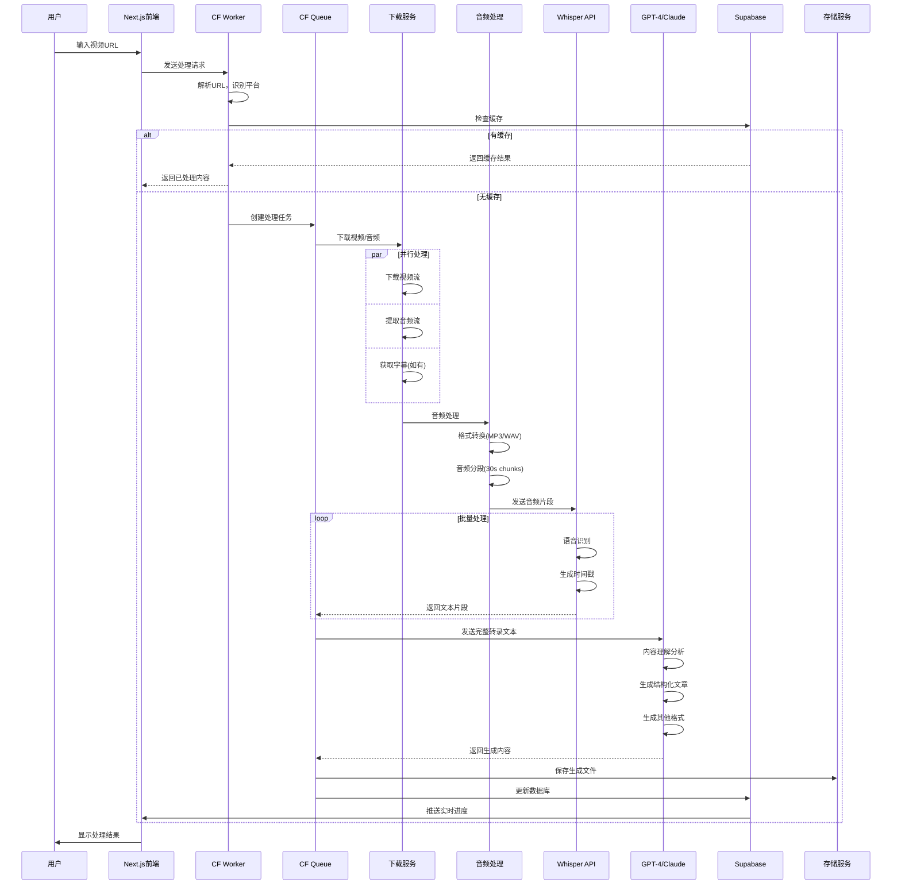
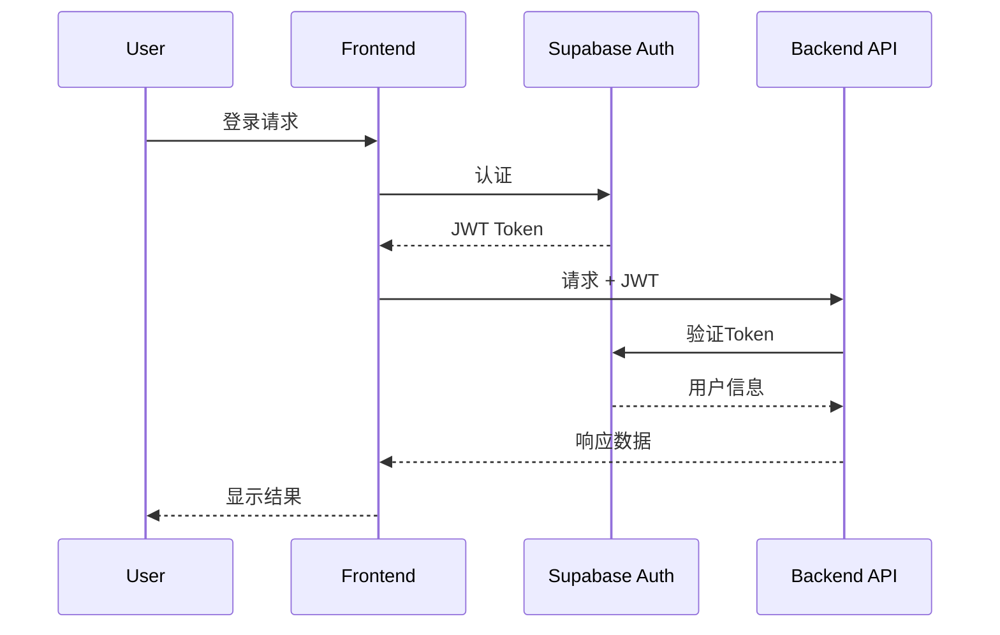

# 影海拾贝 - 技术架构详细说明

## 1. 系统架构概览

### 1.1 架构原则
- **无服务器优先**：充分利用Serverless架构降低运维成本
- **边缘计算**：利用Cloudflare全球节点提供低延迟服务
- **事件驱动**：基于事件的异步处理提高系统响应能力
- **微服务化**：功能模块独立部署，便于扩展和维护
- **渐进增强**：从MVP逐步迭代，快速验证和优化

### 1.2 技术选型理由

| 技术选择 | 选择理由 |
|---------|---------|
| Next.js 14 | 最新App Router提供更好的性能和开发体验，内置优化 |
| TypeScript | 类型安全，提高代码质量和开发效率 |
| Tailwind CSS | 原子化CSS，快速开发，文件体积小 |
| shadcn/ui | 可定制的组件库，完全控制代码 |
| Supabase | 开源BaaS，提供完整后端服务，降低开发成本 |
| Cloudflare Workers | 全球边缘节点，低延迟，按需付费 |
| Cloudflare KV | 分布式键值存储，适合缓存场景 |

## 2. 前端架构

### 2.1 项目结构
```
medialabgen/
├── app/                        # Next.js App Router
│   ├── (auth)/                # 认证相关页面组
│   │   ├── login/
│   │   ├── register/
│   │   └── forgot-password/
│   ├── (dashboard)/           # 需要认证的页面组
│   │   ├── dashboard/
│   │   ├── projects/
│   │   ├── editor/
│   │   └── templates/
│   ├── api/                   # API路由
│   │   ├── auth/
│   │   ├── videos/
│   │   └── generate/
│   ├── layout.tsx             # 根布局
│   └── page.tsx               # 首页
├── components/                 # React组件
│   ├── ui/                    # shadcn/ui组件
│   ├── features/              # 功能组件
│   │   ├── video-parser/
│   │   ├── content-editor/
│   │   ├── format-converter/
│   │   └── ai-assistant/
│   └── layouts/               # 布局组件
├── lib/                       # 工具库
│   ├── supabase/             # Supabase客户端
│   ├── cloudflare/           # Cloudflare集成
│   ├── ai/                   # AI服务集成
│   └── utils/                # 通用工具
├── hooks/                     # React Hooks
├── stores/                    # Zustand状态管理
├── types/                     # TypeScript类型定义
└── styles/                    # 全局样式
```

### 2.2 状态管理架构

```typescript
// stores/index.ts
import { create } from 'zustand'
import { devtools, persist } from 'zustand/middleware'

// 用户状态
interface UserStore {
  user: User | null
  preferences: UserPreferences
  setUser: (user: User | null) => void
  updatePreferences: (preferences: Partial<UserPreferences>) => void
}

// 项目状态
interface ProjectStore {
  currentProject: Project | null
  projects: Project[]
  loadProject: (id: string) => Promise<void>
  updateProject: (id: string, data: Partial<Project>) => void
}

// 任务状态
interface TaskStore {
  tasks: Map<string, Task>
  addTask: (task: Task) => void
  updateTaskProgress: (id: string, progress: number) => void
  removeTask: (id: string) => void
}

// UI状态
interface UIStore {
  theme: 'light' | 'dark' | 'system'
  sidebarOpen: boolean
  activeModal: string | null
  toggleTheme: () => void
  toggleSidebar: () => void
  openModal: (modal: string) => void
  closeModal: () => void
}
```

### 2.3 数据获取策略

```typescript
// 使用 TanStack Query 进行数据管理
import { useQuery, useMutation, useQueryClient } from '@tanstack/react-query'

// 查询键管理
export const queryKeys = {
  projects: ['projects'] as const,
  project: (id: string) => ['projects', id] as const,
  videos: (projectId: string) => ['videos', projectId] as const,
  templates: ['templates'] as const,
}

// 自定义Hook示例
export function useProject(id: string) {
  return useQuery({
    queryKey: queryKeys.project(id),
    queryFn: () => fetchProject(id),
    staleTime: 5 * 60 * 1000, // 5分钟
    cacheTime: 10 * 60 * 1000, // 10分钟
  })
}

export function useCreateProject() {
  const queryClient = useQueryClient()
  
  return useMutation({
    mutationFn: createProject,
    onSuccess: () => {
      queryClient.invalidateQueries({ queryKey: queryKeys.projects })
    },
  })
}
```

## 3. 后端架构

### 3.1 Supabase配置

#### 数据库架构
```sql
-- 启用必要的扩展
CREATE EXTENSION IF NOT EXISTS "uuid-ossp";
CREATE EXTENSION IF NOT EXISTS "pgcrypto";

-- RLS (Row Level Security) 策略
ALTER TABLE projects ENABLE ROW LEVEL SECURITY;
ALTER TABLE video_sources ENABLE ROW LEVEL SECURITY;
ALTER TABLE generated_content ENABLE ROW LEVEL SECURITY;

-- Projects表策略
CREATE POLICY "Users can view own projects" ON projects
  FOR SELECT USING (auth.uid() = user_id);

CREATE POLICY "Users can create own projects" ON projects
  FOR INSERT WITH CHECK (auth.uid() = user_id);

CREATE POLICY "Users can update own projects" ON projects
  FOR UPDATE USING (auth.uid() = user_id);

CREATE POLICY "Users can delete own projects" ON projects
  FOR DELETE USING (auth.uid() = user_id);

-- 公开项目查看策略
CREATE POLICY "Anyone can view public projects" ON projects
  FOR SELECT USING (is_public = true);
```

#### Edge Functions
```typescript
// supabase/functions/process-video/index.ts
import { serve } from 'https://deno.land/std@0.168.0/http/server.ts'
import { createClient } from '@supabase/supabase-js'

serve(async (req) => {
  const { video_url, platform, options } = await req.json()
  
  // 创建Supabase客户端
  const supabaseClient = createClient(
    Deno.env.get('SUPABASE_URL') ?? '',
    Deno.env.get('SUPABASE_ANON_KEY') ?? ''
  )
  
  // 解析视频信息
  const videoInfo = await parseVideoInfo(video_url, platform)
  
  // 保存到数据库
  const { data, error } = await supabaseClient
    .from('video_sources')
    .insert({
      video_url,
      platform,
      ...videoInfo
    })
  
  // 触发异步处理
  await triggerProcessing(data.id, options)
  
  return new Response(
    JSON.stringify({ success: true, data }),
    { headers: { 'Content-Type': 'application/json' } }
  )
})
```

### 3.2 Cloudflare Workers架构

#### API网关
```typescript
// workers/api-gateway/src/index.ts
import { Router } from 'itty-router'
import { withAuth } from './middleware/auth'
import { rateLimit } from './middleware/rateLimit'
import { cache } from './middleware/cache'

const router = Router()

// 中间件配置
router.all('*', rateLimit)
router.all('/api/protected/*', withAuth)

// 路由配置
router.get('/api/videos/:id', cache(300), handleGetVideo)
router.post('/api/videos/parse', handleParseVideo)
router.post('/api/generate/:type', handleGenerate)

// 错误处理
router.all('*', () => 
  new Response('Not Found', { status: 404 })
)

export default {
  async fetch(request: Request, env: Env, ctx: ExecutionContext) {
    return router.handle(request, env, ctx)
  }
}
```

#### 任务队列处理
```typescript
// workers/task-processor/src/index.ts
export default {
  async queue(batch: MessageBatch, env: Env): Promise<void> {
    for (const message of batch.messages) {
      const task = message.body as Task
      
      try {
        switch (task.type) {
          case 'extract_subtitle':
            await processSubtitleExtraction(task, env)
            break
          case 'generate_article':
            await generateArticle(task, env)
            break
          case 'generate_mindmap':
            await generateMindmap(task, env)
            break
          default:
            console.error(`Unknown task type: ${task.type}`)
        }
        
        // 标记消息已处理
        message.ack()
      } catch (error) {
        // 重试逻辑
        if (message.attempts < 3) {
          message.retry({ delaySeconds: 60 * message.attempts })
        } else {
          // 记录失败
          await logFailure(task, error, env)
          message.ack()
        }
      }
    }
  }
}
```

#### KV缓存策略
```typescript
// workers/cache/src/index.ts
interface CacheStrategy {
  key: string
  ttl: number // seconds
  staleWhileRevalidate?: boolean
}

class CacheManager {
  constructor(private kv: KVNamespace) {}
  
  async get<T>(key: string): Promise<T | null> {
    const cached = await this.kv.get(key, 'json')
    if (!cached) return null
    
    const { data, expires } = cached as CachedData<T>
    if (Date.now() > expires) {
      // 过期处理
      if (this.shouldRevalidate(key)) {
        this.revalidate(key)
      }
      return null
    }
    
    return data
  }
  
  async set<T>(key: string, data: T, ttl: number): Promise<void> {
    const cached: CachedData<T> = {
      data,
      expires: Date.now() + ttl * 1000,
      cached_at: Date.now()
    }
    
    await this.kv.put(key, JSON.stringify(cached), {
      expirationTtl: ttl
    })
  }
  
  async invalidate(pattern: string): Promise<void> {
    const keys = await this.kv.list({ prefix: pattern })
    await Promise.all(
      keys.keys.map(key => this.kv.delete(key.name))
    )
  }
}
```

## 4. AI服务集成

### 4.1 AI服务抽象层
```typescript
// lib/ai/provider.ts
interface AIProvider {
  generateSummary(text: string, options?: SummaryOptions): Promise<string>
  generateArticle(content: Content, template?: Template): Promise<Article>
  extractKeyPoints(text: string): Promise<KeyPoint[]>
  translateText(text: string, targetLang: string): Promise<string>
}

class OpenAIProvider implements AIProvider {
  private client: OpenAI
  
  constructor(apiKey: string) {
    this.client = new OpenAI({ apiKey })
  }
  
  async generateSummary(text: string, options?: SummaryOptions) {
    const response = await this.client.chat.completions.create({
      model: 'gpt-4-turbo-preview',
      messages: [
        {
          role: 'system',
          content: 'You are a professional content summarizer...'
        },
        {
          role: 'user',
          content: `Summarize the following text: ${text}`
        }
      ],
      temperature: options?.temperature ?? 0.7,
      max_tokens: options?.maxTokens ?? 500
    })
    
    return response.choices[0].message.content
  }
}

class ClaudeProvider implements AIProvider {
  // Claude实现
}

// AI服务工厂
class AIServiceFactory {
  static create(provider: 'openai' | 'claude', config: AIConfig): AIProvider {
    switch (provider) {
      case 'openai':
        return new OpenAIProvider(config.apiKey)
      case 'claude':
        return new ClaudeProvider(config.apiKey)
      default:
        throw new Error(`Unknown provider: ${provider}`)
    }
  }
}
```

### 4.2 提示词工程
```typescript
// lib/ai/prompts.ts
export const PROMPTS = {
  summary: {
    system: `You are an expert content summarizer. Your task is to create concise, 
             informative summaries that capture the key points while maintaining clarity.`,
    user: (content: string, style: 'brief' | 'detailed' | 'bullet') => {
      const styleInstructions = {
        brief: 'Create a 2-3 sentence summary',
        detailed: 'Create a comprehensive summary with main points and sub-points',
        bullet: 'Create a bullet-point summary with 5-7 key points'
      }
      
      return `${styleInstructions[style]}. Content: ${content}`
    }
  },
  
  article: {
    system: `You are a professional content writer. Transform video transcripts 
             into well-structured articles with proper formatting.`,
    user: (transcript: string, template: ArticleTemplate) => {
      return `Transform this transcript into an article following this template:
              Style: ${template.style}
              Tone: ${template.tone}
              Length: ${template.length} words
              Include: ${template.sections.join(', ')}
              
              Transcript: ${transcript}`
    }
  },
  
  mindmap: {
    system: `You are an expert at creating mind maps and visual knowledge structures.`,
    user: (content: string) => {
      return `Create a hierarchical mind map structure from this content.
              Format as JSON with nodes and relationships.
              Content: ${content}`
    }
  }
}
```

## 5. 核心视频处理完整架构

### 5.1 处理流程总览

```
┌─────────────────────────────────────────────────────────────────────────────┐
│                          视频处理核心流程架构                               │
├─────────────────────────────────────────────────────────────────────────────┤
│                                                                             │
│  1. URL输入层                                                               │
│  ┌─────────────┐                                                           │
│  │  用户输入   │ → YouTube/TED/Bilibili/Vimeo URL                          │
│  └─────────────┘                                                           │
│         ↓                                                                   │
│  2. 解析识别层                                                              │
│  ┌─────────────────────────────────────────────────────────┐              │
│  │  URL Parser  │  Platform Detector  │  Metadata Fetcher  │              │
│  └─────────────────────────────────────────────────────────┘              │
│         ↓                                                                   │
│  3. 内容下载层                                                              │
│  ┌──────────────┬──────────────┬──────────────┬──────────┐               │
│  │ Video Stream │ Audio Stream │   Subtitles  │ Thumbnail│               │
│  │   Downloader │   Extractor  │   Downloader │  Fetcher │               │
│  └──────────────┴──────────────┴──────────────┴──────────┘               │
│         ↓                                                                   │
│  4. 音频处理层                                                              │
│  ┌──────────────────────────────────────────────────────┐                │
│  │   FFmpeg     →    Audio Chunks   →   Noise Reduction  │                │
│  │  Processing       Segmentation        & Normalization  │                │
│  └──────────────────────────────────────────────────────┘                │
│         ↓                                                                   │
│  5. 语音识别层 (ASR)                                                        │
│  ┌──────────────────────────────────────────────────────┐                │
│  │  Whisper API  →  Speech-to-Text  →  Timestamp Align   │                │
│  │   (OpenAI)        Recognition         & Punctuation    │                │
│  └──────────────────────────────────────────────────────┘                │
│         ↓                                                                   │
│  6. AI处理层                                                                │
│  ┌──────────────────────────────────────────────────────┐                │
│  │  Content      →     Structure     →    Multi-format   │                │
│  │  Analysis          Generation          Export          │                │
│  │  (GPT-4/Claude)    (Article/PPT)      (MD/PDF/DOCX)   │                │
│  └──────────────────────────────────────────────────────┘                │
│         ↓                                                                   │
│  7. 输出存储层                                                              │
│  ┌─────────────────────────────────────────────────────────┐              │
│  │  Supabase Storage  │  Cloudflare R2  │  Cache (KV)     │              │
│  └─────────────────────────────────────────────────────────┘              │
└─────────────────────────────────────────────────────────────────────────────┘
```

### 5.2 详细时序图



### 5.3 技术实现细节

#### 5.3.1 URL解析和平台识别

```typescript
// lib/video/urlParser.ts
interface VideoInfo {
  platform: 'youtube' | 'ted' | 'bilibili' | 'vimeo'
  videoId: string
  url: string
  embedUrl?: string
}

class URLParser {
  private patterns = {
    youtube: [
      /(?:youtube\.com\/watch\?v=|youtu\.be\/|youtube\.com\/embed\/)([^&\s]+)/,
      /youtube\.com\/v\/([^&\s]+)/
    ],
    ted: [
      /ted\.com\/talks\/([^\/\s]+)/
    ],
    bilibili: [
      /bilibili\.com\/video\/(BV[\w]+)/,
      /b23\.tv\/([^\/\s]+)/
    ],
    vimeo: [
      /vimeo\.com\/(\d+)/
    ]
  }

  parse(url: string): VideoInfo | null {
    for (const [platform, patterns] of Object.entries(this.patterns)) {
      for (const pattern of patterns) {
        const match = url.match(pattern)
        if (match) {
          return {
            platform: platform as VideoInfo['platform'],
            videoId: match[1],
            url: url,
            embedUrl: this.getEmbedUrl(platform, match[1])
          }
        }
      }
    }
    return null
  }
}
```

#### 5.3.2 视频下载服务

```typescript
// workers/downloader/index.ts
export default {
  async fetch(request: Request, env: Env) {
    const { url, options } = await request.json()
    
    // 使用 yt-dlp 通过子进程下载
    const downloadCmd = {
      youtube: `yt-dlp -f "bestaudio/best" --extract-audio --audio-format mp3`,
      ted: `yt-dlp --write-subs --sub-langs en,zh`,
      bilibili: `yt-dlp --cookies cookies.txt`,
    }
    
    // 获取视频元数据
    const metadata = await this.getVideoMetadata(url)
    
    // 检查是否有现成字幕
    if (metadata.subtitles) {
      await this.downloadSubtitles(metadata.subtitles)
    }
    
    // 下载音频流
    const audioUrl = await this.downloadAudio(url, metadata)
    
    // 存储到 R2
    await env.R2.put(`audio/${metadata.id}.mp3`, audioUrl)
    
    return new Response(JSON.stringify({
      success: true,
      metadata,
      audioUrl
    }))
  }
}
```

#### 5.3.3 音频处理和分段

```typescript
// lib/audio/processor.ts
import ffmpeg from 'fluent-ffmpeg'

class AudioProcessor {
  async processAudio(inputPath: string): Promise<AudioChunk[]> {
    const chunks: AudioChunk[] = []
    
    // 获取音频时长
    const duration = await this.getAudioDuration(inputPath)
    
    // 分段处理（30秒一段，便于API调用）
    const chunkDuration = 30
    const numChunks = Math.ceil(duration / chunkDuration)
    
    for (let i = 0; i < numChunks; i++) {
      const startTime = i * chunkDuration
      const outputPath = `chunk_${i}.mp3`
      
      await new Promise((resolve, reject) => {
        ffmpeg(inputPath)
          .setStartTime(startTime)
          .setDuration(chunkDuration)
          .audioCodec('libmp3lame')
          .audioBitrate('128k')
          .audioChannels(1) // 单声道，减小文件大小
          .audioFrequency(16000) // 16kHz，适合语音识别
          .on('end', resolve)
          .on('error', reject)
          .save(outputPath)
      })
      
      chunks.push({
        index: i,
        startTime,
        duration: Math.min(chunkDuration, duration - startTime),
        path: outputPath
      })
    }
    
    return chunks
  }
}
```

#### 5.3.4 Whisper语音识别集成

```typescript
// lib/ai/whisper.ts
import { OpenAI } from 'openai'

class WhisperService {
  private client: OpenAI
  
  constructor(apiKey: string) {
    this.client = new OpenAI({ apiKey })
  }
  
  async transcribeAudio(audioPath: string, language?: string): Promise<Transcript> {
    const audioFile = await fs.readFile(audioPath)
    
    const response = await this.client.audio.transcriptions.create({
      file: audioFile,
      model: 'whisper-1',
      language: language || 'en',
      response_format: 'verbose_json', // 包含时间戳
      timestamp_granularities: ['segment', 'word']
    })
    
    return {
      text: response.text,
      segments: response.segments.map(seg => ({
        start: seg.start,
        end: seg.end,
        text: seg.text,
        words: seg.words
      })),
      language: response.language,
      duration: response.duration
    }
  }
  
  async batchTranscribe(chunks: AudioChunk[]): Promise<FullTranscript> {
    const transcripts = await Promise.all(
      chunks.map(chunk => this.transcribeAudio(chunk.path))
    )
    
    // 合并所有片段，调整时间戳
    return this.mergeTranscripts(transcripts, chunks)
  }
}
```

#### 5.3.5 AI文章生成管道

```typescript
// lib/ai/contentGenerator.ts
class ContentGenerator {
  private llm: OpenAI | Anthropic
  
  async generateArticle(transcript: FullTranscript, options: GenerateOptions) {
    const systemPrompt = `
      你是一个专业的内容创作者，擅长将视频内容转化为高质量的文章。
      请根据提供的视频转录文本，生成一篇结构清晰、内容丰富的文章。
      
      要求：
      1. 提取核心观点和关键信息
      2. 组织逻辑清晰的文章结构
      3. 添加适当的标题和段落
      4. 保持原始内容的准确性
      5. 优化语言表达，提高可读性
    `
    
    const userPrompt = `
      视频标题：${options.title}
      视频时长：${options.duration}
      
      转录文本：
      ${transcript.text}
      
      请生成一篇${options.length}字左右的${options.style}风格文章。
    `
    
    const response = await this.llm.chat.completions.create({
      model: 'gpt-4-turbo',
      messages: [
        { role: 'system', content: systemPrompt },
        { role: 'user', content: userPrompt }
      ],
      temperature: 0.7,
      max_tokens: options.maxTokens || 2000
    })
    
    return this.formatArticle(response.choices[0].message.content)
  }
  
  async generateMultipleFormats(transcript: FullTranscript) {
    const tasks = [
      this.generateArticle(transcript, { format: 'article' }),
      this.generatePPT(transcript),
      this.generateMindmap(transcript),
      this.generateQA(transcript)
    ]
    
    const results = await Promise.allSettled(tasks)
    return this.consolidateResults(results)
  }
}
```

### 5.4 视频平台适配器
```typescript
// lib/video/adapters/base.ts
abstract class VideoAdapter {
  abstract parseUrl(url: string): VideoInfo
  abstract getMetadata(videoId: string): Promise<VideoMetadata>
  abstract getSubtitles(videoId: string): Promise<Subtitle[]>
  abstract getThumbnail(videoId: string): string
  abstract downloadVideo?(videoId: string): Promise<Blob>
}

// lib/video/adapters/youtube.ts
class YouTubeAdapter extends VideoAdapter {
  async getMetadata(videoId: string): Promise<VideoMetadata> {
    // 使用YouTube API或第三方服务
    const response = await fetch(
      `https://www.googleapis.com/youtube/v3/videos?id=${videoId}&key=${API_KEY}`
    )
    const data = await response.json()
    
    return {
      title: data.items[0].snippet.title,
      description: data.items[0].snippet.description,
      duration: this.parseDuration(data.items[0].contentDetails.duration),
      publishedAt: data.items[0].snippet.publishedAt,
      channelTitle: data.items[0].snippet.channelTitle,
      tags: data.items[0].snippet.tags,
      viewCount: data.items[0].statistics.viewCount
    }
  }
  
  async getSubtitles(videoId: string): Promise<Subtitle[]> {
    // 获取字幕
    const subtitles = await this.fetchSubtitles(videoId)
    return this.parseSubtitles(subtitles)
  }
}

// 其他平台适配器
class BilibiliAdapter extends VideoAdapter { /* ... */ }
class TedAdapter extends VideoAdapter { /* ... */ }
```

### 5.2 内容提取流水线
```typescript
// lib/video/pipeline.ts
class ExtractionPipeline {
  private stages: ExtractionStage[] = []
  
  addStage(stage: ExtractionStage): this {
    this.stages.push(stage)
    return this
  }
  
  async execute(input: VideoSource): Promise<ExtractedContent> {
    let result: any = input
    
    for (const stage of this.stages) {
      result = await stage.process(result)
      
      // 更新进度
      await this.updateProgress(stage.name, stage.progress)
      
      // 错误处理
      if (stage.error) {
        throw new PipelineError(stage.name, stage.error)
      }
    }
    
    return result as ExtractedContent
  }
}

// 使用示例
const pipeline = new ExtractionPipeline()
  .addStage(new MetadataExtractor())
  .addStage(new SubtitleExtractor())
  .addStage(new AudioExtractor())
  .addStage(new KeyframeExtractor())
  .addStage(new ContentAnalyzer())
  .addStage(new AIEnhancer())

const content = await pipeline.execute(videoSource)
```

## 6. 性能优化和错误处理

### 6.1 缓存策略

```typescript
// lib/cache/videoCache.ts
class VideoCache {
  private kv: KVNamespace
  private r2: R2Bucket
  
  // 多级缓存策略
  async get(videoId: string): Promise<CachedContent | null> {
    // L1: KV缓存（元数据）
    const metadata = await this.kv.get(`meta:${videoId}`, 'json')
    if (!metadata) return null
    
    // L2: R2存储（内容文件）
    const content = await this.r2.get(`content/${videoId}`)
    if (!content) return null
    
    // 检查缓存有效期
    if (this.isExpired(metadata.cachedAt)) {
      await this.invalidate(videoId)
      return null
    }
    
    return { metadata, content }
  }
  
  async set(videoId: string, content: ProcessedContent) {
    // 存储元数据到KV（快速访问）
    await this.kv.put(
      `meta:${videoId}`,
      JSON.stringify({
        ...content.metadata,
        cachedAt: Date.now()
      }),
      { expirationTtl: 86400 * 7 } // 7天过期
    )
    
    // 存储内容到R2（大文件）
    await this.r2.put(
      `content/${videoId}`,
      content.data
    )
  }
}
```

### 6.2 并发控制和限流

```typescript
// lib/rateLimit/concurrencyControl.ts
class ConcurrencyController {
  private activeJobs: Map<string, Job> = new Map()
  private queue: Job[] = []
  private maxConcurrent = 5
  
  async process(job: Job): Promise<any> {
    // 检查是否已在处理
    if (this.activeJobs.has(job.id)) {
      return this.activeJobs.get(job.id)!.promise
    }
    
    // 检查并发限制
    if (this.activeJobs.size >= this.maxConcurrent) {
      await this.waitForSlot()
    }
    
    // 开始处理
    const promise = this.executeJob(job)
    this.activeJobs.set(job.id, { ...job, promise })
    
    try {
      const result = await promise
      return result
    } finally {
      this.activeJobs.delete(job.id)
      this.processQueue()
    }
  }
  
  private async executeJob(job: Job) {
    // 使用信号量控制资源访问
    const semaphore = new Semaphore(1)
    await semaphore.acquire()
    
    try {
      return await job.execute()
    } finally {
      semaphore.release()
    }
  }
}
```

### 6.3 错误处理和重试机制

```typescript
// lib/error/retryHandler.ts
class RetryHandler {
  async executeWithRetry<T>(
    fn: () => Promise<T>,
    options: RetryOptions = {}
  ): Promise<T> {
    const {
      maxRetries = 3,
      backoff = 'exponential',
      initialDelay = 1000,
      maxDelay = 30000,
      retryOn = [500, 502, 503, 504]
    } = options
    
    let lastError: Error
    
    for (let attempt = 0; attempt <= maxRetries; attempt++) {
      try {
        return await fn()
      } catch (error) {
        lastError = error as Error
        
        // 检查是否应该重试
        if (!this.shouldRetry(error, retryOn) || attempt === maxRetries) {
          throw error
        }
        
        // 计算延迟时间
        const delay = this.calculateDelay(
          attempt,
          backoff,
          initialDelay,
          maxDelay
        )
        
        // 记录重试
        console.log(`Retry attempt ${attempt + 1}/${maxRetries} after ${delay}ms`)
        
        await this.sleep(delay)
      }
    }
    
    throw lastError!
  }
  
  private shouldRetry(error: any, retryOn: number[]): boolean {
    if (error.response?.status) {
      return retryOn.includes(error.response.status)
    }
    // 网络错误也重试
    return error.code === 'ECONNRESET' || 
           error.code === 'ETIMEDOUT' ||
           error.code === 'ENOTFOUND'
  }
  
  private calculateDelay(
    attempt: number,
    backoff: string,
    initialDelay: number,
    maxDelay: number
  ): number {
    let delay = initialDelay
    
    if (backoff === 'exponential') {
      delay = Math.min(initialDelay * Math.pow(2, attempt), maxDelay)
    } else if (backoff === 'linear') {
      delay = Math.min(initialDelay * (attempt + 1), maxDelay)
    }
    
    // 添加抖动
    return delay + Math.random() * 1000
  }
}
```

### 6.4 处理优化策略

```typescript
// lib/optimization/processingOptimizer.ts
class ProcessingOptimizer {
  // 智能分片策略
  async optimizeChunking(audio: AudioFile): ChunkStrategy {
    const duration = audio.duration
    const fileSize = audio.size
    
    // 根据文件大小和时长动态调整分片策略
    if (duration < 300) { // 5分钟以内
      return {
        chunkSize: 60, // 60秒一片
        parallel: true,
        maxConcurrent: 3
      }
    } else if (duration < 1800) { // 30分钟以内
      return {
        chunkSize: 30, // 30秒一片
        parallel: true,
        maxConcurrent: 5
      }
    } else {
      return {
        chunkSize: 20, // 20秒一片
        parallel: true,
        maxConcurrent: 10,
        useQueue: true // 使用队列防止过载
      }
    }
  }
  
  // 自适应质量控制
  async adaptiveQuality(context: ProcessingContext): QualitySettings {
    const { userTier, currentLoad, videoQuality } = context
    
    // 根据用户等级和系统负载调整质量
    if (userTier === 'premium' && currentLoad < 0.7) {
      return {
        audioQuality: 'high',
        transcriptionAccuracy: 'best',
        aiModel: 'gpt-4-turbo'
      }
    } else if (currentLoad > 0.9) {
      return {
        audioQuality: 'medium',
        transcriptionAccuracy: 'good',
        aiModel: 'gpt-3.5-turbo'
      }
    }
    
    return {
      audioQuality: 'medium',
      transcriptionAccuracy: 'better',
      aiModel: 'gpt-4'
    }
  }
}
```

## 7. 完整端到端处理示例

### 7.1 完整的视频处理流程代码

```typescript
// app/api/videos/process/route.ts
import { VideoProcessor } from '@/lib/video/processor'
import { supabase } from '@/lib/supabase'

export async function POST(request: Request) {
  const { url, userId, options } = await request.json()
  
  // 初始化处理器
  const processor = new VideoProcessor({
    supabase,
    userId,
    options
  })
  
  try {
    // 1. 解析和验证URL
    const videoInfo = await processor.parseURL(url)
    if (!videoInfo) {
      return Response.json({ error: 'Invalid URL' }, { status: 400 })
    }
    
    // 2. 检查缓存
    const cached = await processor.checkCache(videoInfo.videoId)
    if (cached) {
      return Response.json({ 
        success: true, 
        data: cached,
        fromCache: true 
      })
    }
    
    // 3. 创建处理任务
    const task = await processor.createTask({
      videoInfo,
      userId,
      options
    })
    
    // 4. 开始异步处理
    processor.startProcessing(task.id).catch(console.error)
    
    // 5. 返回任务ID供前端轮询
    return Response.json({
      success: true,
      taskId: task.id,
      estimatedTime: processor.estimateTime(videoInfo)
    })
    
  } catch (error) {
    console.error('Processing error:', error)
    return Response.json(
      { error: 'Processing failed' },
      { status: 500 }
    )
  }
}
```

### 7.2 完整的VideoProcessor类实现

```typescript
// lib/video/processor.ts
export class VideoProcessor {
  private urlParser: URLParser
  private downloader: VideoDownloader
  private audioProcessor: AudioProcessor
  private whisperService: WhisperService
  private contentGenerator: ContentGenerator
  private cache: VideoCache
  
  constructor(config: ProcessorConfig) {
    this.urlParser = new URLParser()
    this.downloader = new VideoDownloader(config)
    this.audioProcessor = new AudioProcessor()
    this.whisperService = new WhisperService(config.openaiKey)
    this.contentGenerator = new ContentGenerator(config.aiModel)
    this.cache = new VideoCache(config.kv, config.r2)
  }
  
  async startProcessing(taskId: string) {
    const task = await this.getTask(taskId)
    
    try {
      // 更新状态：下载中
      await this.updateTaskStatus(taskId, 'downloading', 10)
      
      // 1. 下载视频/音频
      const { audioPath, subtitles } = await this.downloader.download(
        task.videoInfo.url,
        task.videoInfo.platform
      )
      
      // 更新状态：处理音频
      await this.updateTaskStatus(taskId, 'processing_audio', 30)
      
      // 2. 处理音频（分段）
      const chunks = await this.audioProcessor.processAudio(audioPath)
      
      // 更新状态：语音识别
      await this.updateTaskStatus(taskId, 'transcribing', 50)
      
      // 3. 语音识别（如果没有字幕）
      let transcript: FullTranscript
      if (subtitles && subtitles.length > 0) {
        transcript = this.parseSubtitles(subtitles)
      } else {
        transcript = await this.whisperService.batchTranscribe(chunks)
      }
      
      // 更新状态：AI生成
      await this.updateTaskStatus(taskId, 'generating', 70)
      
      // 4. AI内容生成
      const generatedContent = await this.contentGenerator.generateMultipleFormats(
        transcript,
        task.options
      )
      
      // 更新状态：保存结果
      await this.updateTaskStatus(taskId, 'saving', 90)
      
      // 5. 保存结果
      const result = await this.saveResults({
        taskId,
        videoInfo: task.videoInfo,
        transcript,
        generatedContent
      })
      
      // 6. 缓存结果
      await this.cache.set(task.videoInfo.videoId, result)
      
      // 更新状态：完成
      await this.updateTaskStatus(taskId, 'completed', 100, result)
      
      // 7. 清理临时文件
      await this.cleanup(audioPath, chunks)
      
    } catch (error) {
      // 错误处理
      await this.handleError(taskId, error)
      throw error
    }
  }
  
  private async updateTaskStatus(
    taskId: string, 
    status: string, 
    progress: number,
    result?: any
  ) {
    await this.supabase
      .from('extraction_tasks')
      .update({
        status,
        progress,
        result_data: result,
        updated_at: new Date().toISOString()
      })
      .eq('id', taskId)
    
    // 发送实时更新
    await this.sendRealtimeUpdate(taskId, { status, progress })
  }
  
  private async handleError(taskId: string, error: any) {
    console.error(`Task ${taskId} failed:`, error)
    
    await this.supabase
      .from('extraction_tasks')
      .update({
        status: 'failed',
        error_message: error.message,
        completed_at: new Date().toISOString()
      })
      .eq('id', taskId)
  }
}
```

### 7.3 前端实时进度监听

```typescript
// hooks/useVideoProcessing.ts
import { useEffect, useState } from 'react'
import { supabase } from '@/lib/supabase'

export function useVideoProcessing(taskId: string | null) {
  const [status, setStatus] = useState<TaskStatus | null>(null)
  const [progress, setProgress] = useState(0)
  const [result, setResult] = useState<any>(null)
  
  useEffect(() => {
    if (!taskId) return
    
    // 订阅实时更新
    const channel = supabase
      .channel(`task:${taskId}`)
      .on('postgres_changes', {
        event: 'UPDATE',
        schema: 'public',
        table: 'extraction_tasks',
        filter: `id=eq.${taskId}`
      }, (payload) => {
        const task = payload.new
        setStatus(task.status)
        setProgress(task.progress)
        
        if (task.status === 'completed') {
          setResult(task.result_data)
        }
      })
      .subscribe()
    
    // 初始加载
    loadTaskStatus(taskId)
    
    return () => {
      channel.unsubscribe()
    }
  }, [taskId])
  
  const loadTaskStatus = async (id: string) => {
    const { data, error } = await supabase
      .from('extraction_tasks')
      .select('*')
      .eq('id', id)
      .single()
    
    if (data) {
      setStatus(data.status)
      setProgress(data.progress)
      setResult(data.result_data)
    }
  }
  
  return { status, progress, result }
}
```

## 8. 实时通信架构

### 8.1 WebSocket管理
```typescript
// lib/realtime/socket.ts
class RealtimeManager {
  private supabase: SupabaseClient
  private subscriptions: Map<string, RealtimeChannel> = new Map()
  
  constructor(supabase: SupabaseClient) {
    this.supabase = supabase
  }
  
  subscribeToTask(taskId: string, callbacks: TaskCallbacks) {
    const channel = this.supabase
      .channel(`task:${taskId}`)
      .on('postgres_changes', {
        event: 'UPDATE',
        schema: 'public',
        table: 'extraction_tasks',
        filter: `id=eq.${taskId}`
      }, (payload) => {
        const task = payload.new as Task
        
        if (task.status === 'processing') {
          callbacks.onProgress?.(task.progress)
        } else if (task.status === 'completed') {
          callbacks.onComplete?.(task.result_data)
        } else if (task.status === 'failed') {
          callbacks.onError?.(task.error_message)
        }
      })
      .subscribe()
    
    this.subscriptions.set(taskId, channel)
    return () => this.unsubscribe(taskId)
  }
  
  unsubscribe(taskId: string) {
    const channel = this.subscriptions.get(taskId)
    if (channel) {
      channel.unsubscribe()
      this.subscriptions.delete(taskId)
    }
  }
}
```

### 6.2 Server-Sent Events备选方案
```typescript
// app/api/tasks/[id]/stream/route.ts
export async function GET(
  request: Request,
  { params }: { params: { id: string } }
) {
  const encoder = new TextEncoder()
  
  const stream = new ReadableStream({
    async start(controller) {
      const sendEvent = (data: any) => {
        controller.enqueue(
          encoder.encode(`data: ${JSON.stringify(data)}\n\n`)
        )
      }
      
      // 订阅任务更新
      const unsubscribe = subscribeToTaskUpdates(params.id, (update) => {
        sendEvent(update)
        
        if (update.status === 'completed' || update.status === 'failed') {
          unsubscribe()
          controller.close()
        }
      })
      
      // 心跳保持连接
      const heartbeat = setInterval(() => {
        sendEvent({ type: 'ping' })
      }, 30000)
      
      // 清理
      request.signal.addEventListener('abort', () => {
        clearInterval(heartbeat)
        unsubscribe()
        controller.close()
      })
    }
  })
  
  return new Response(stream, {
    headers: {
      'Content-Type': 'text/event-stream',
      'Cache-Control': 'no-cache',
      'Connection': 'keep-alive'
    }
  })
}
```

## 7. 部署架构

### 7.1 多环境配置
```typescript
// config/environments.ts
export const config = {
  development: {
    supabase: {
      url: process.env.NEXT_PUBLIC_SUPABASE_URL_DEV,
      anonKey: process.env.NEXT_PUBLIC_SUPABASE_ANON_KEY_DEV,
    },
    cloudflare: {
      accountId: process.env.CF_ACCOUNT_ID_DEV,
      apiToken: process.env.CF_API_TOKEN_DEV,
    },
    ai: {
      openaiKey: process.env.OPENAI_API_KEY_DEV,
      claudeKey: process.env.CLAUDE_API_KEY_DEV,
    }
  },
  staging: {
    // 测试环境配置
  },
  production: {
    // 生产环境配置
  }
}

export function getConfig() {
  const env = process.env.NODE_ENV || 'development'
  return config[env]
}
```

### 7.2 Docker容器化
```dockerfile
# Dockerfile
FROM node:20-alpine AS deps
WORKDIR /app
COPY package.json package-lock.json ./
RUN npm ci --only=production

FROM node:20-alpine AS builder
WORKDIR /app
COPY package.json package-lock.json ./
RUN npm ci
COPY . .
RUN npm run build

FROM node:20-alpine AS runner
WORKDIR /app

ENV NODE_ENV production

RUN addgroup --system --gid 1001 nodejs
RUN adduser --system --uid 1001 nextjs

COPY --from=builder /app/public ./public
COPY --from=builder /app/.next/standalone ./
COPY --from=builder /app/.next/static ./.next/static

USER nextjs

EXPOSE 3000

ENV PORT 3000

CMD ["node", "server.js"]
```

### 7.3 CI/CD Pipeline
```yaml
# .github/workflows/deploy.yml
name: Deploy to Production

on:
  push:
    branches: [main]
  pull_request:
    branches: [main]

jobs:
  test:
    runs-on: ubuntu-latest
    steps:
      - uses: actions/checkout@v3
      - uses: actions/setup-node@v3
        with:
          node-version: '20'
          cache: 'npm'
      
      - run: npm ci
      - run: npm run lint
      - run: npm run type-check
      - run: npm test
      - run: npm run test:e2e

  build:
    needs: test
    runs-on: ubuntu-latest
    steps:
      - uses: actions/checkout@v3
      - uses: actions/setup-node@v3
        with:
          node-version: '20'
          cache: 'npm'
      
      - run: npm ci
      - run: npm run build
      
      - uses: actions/upload-artifact@v3
        with:
          name: build-files
          path: .next/

  deploy-vercel:
    needs: build
    runs-on: ubuntu-latest
    if: github.ref == 'refs/heads/main'
    steps:
      - uses: actions/checkout@v3
      - uses: vercel/action@v28
        with:
          vercel-token: ${{ secrets.VERCEL_TOKEN }}
          vercel-org-id: ${{ secrets.VERCEL_ORG_ID }}
          vercel-project-id: ${{ secrets.VERCEL_PROJECT_ID }}
          vercel-args: '--prod'

  deploy-workers:
    needs: build
    runs-on: ubuntu-latest
    if: github.ref == 'refs/heads/main'
    steps:
      - uses: actions/checkout@v3
      - uses: cloudflare/wrangler-action@v3
        with:
          apiToken: ${{ secrets.CF_API_TOKEN }}
          workingDirectory: 'workers'
          command: 'publish --env production'

  migrate-database:
    needs: [deploy-vercel, deploy-workers]
    runs-on: ubuntu-latest
    if: github.ref == 'refs/heads/main'
    steps:
      - uses: actions/checkout@v3
      - uses: supabase/setup-cli@v1
      - run: supabase db push --db-url ${{ secrets.SUPABASE_DB_URL }}
```

## 8. 监控和日志

### 8.1 应用监控
```typescript
// lib/monitoring/index.ts
import * as Sentry from '@sentry/nextjs'
import { metrics } from '@opentelemetry/api'

// Sentry配置
Sentry.init({
  dsn: process.env.SENTRY_DSN,
  environment: process.env.NODE_ENV,
  tracesSampleRate: 1.0,
  profilesSampleRate: 1.0,
})

// 性能监控
export class PerformanceMonitor {
  private meter = metrics.getMeter('yinghaishibe')
  
  private requestDuration = this.meter.createHistogram('http_request_duration', {
    description: 'Duration of HTTP requests in milliseconds',
    unit: 'ms',
  })
  
  private activeUsers = this.meter.createUpDownCounter('active_users', {
    description: 'Number of active users',
  })
  
  recordRequest(method: string, path: string, duration: number, status: number) {
    this.requestDuration.record(duration, {
      method,
      path,
      status: status.toString(),
    })
  }
  
  incrementActiveUsers() {
    this.activeUsers.add(1)
  }
  
  decrementActiveUsers() {
    this.activeUsers.add(-1)
  }
}
```

### 8.2 日志系统
```typescript
// lib/logging/index.ts
import winston from 'winston'
import { LogtailTransport } from '@logtail/winston'

const logger = winston.createLogger({
  level: process.env.LOG_LEVEL || 'info',
  format: winston.format.combine(
    winston.format.timestamp(),
    winston.format.errors({ stack: true }),
    winston.format.json(),
  ),
  defaultMeta: {
    service: 'yinghaishibe',
    environment: process.env.NODE_ENV,
  },
  transports: [
    new winston.transports.Console({
      format: winston.format.simple(),
    }),
    new LogtailTransport({
      sourceToken: process.env.LOGTAIL_TOKEN,
    }),
  ],
})

export default logger
```

## 9. 安全架构

### 9.1 认证流程


### 9.2 安全中间件
```typescript
// middleware/security.ts
import { NextResponse } from 'next/server'
import type { NextRequest } from 'next/server'
import { createServerClient } from '@supabase/ssr'

export async function middleware(request: NextRequest) {
  const response = NextResponse.next()
  
  // CSRF保护
  if (request.method !== 'GET') {
    const token = request.headers.get('x-csrf-token')
    if (!token || !verifyCSRFToken(token)) {
      return new NextResponse('Invalid CSRF token', { status: 403 })
    }
  }
  
  // 认证检查
  const supabase = createServerClient(
    process.env.NEXT_PUBLIC_SUPABASE_URL!,
    process.env.NEXT_PUBLIC_SUPABASE_ANON_KEY!,
    {
      cookies: {
        get(name: string) {
          return request.cookies.get(name)?.value
        },
        set(name: string, value: string, options: any) {
          response.cookies.set({ name, value, ...options })
        },
        remove(name: string, options: any) {
          response.cookies.set({ name, value: '', ...options })
        },
      },
    }
  )
  
  const { data: { session } } = await supabase.auth.getSession()
  
  // 保护路由
  if (request.nextUrl.pathname.startsWith('/api/protected')) {
    if (!session) {
      return new NextResponse('Unauthorized', { status: 401 })
    }
  }
  
  return response
}

export const config = {
  matcher: ['/api/:path*', '/dashboard/:path*']
}
```

## 10. 性能优化策略

### 10.1 前端优化
```typescript
// 图片优化
import Image from 'next/image'

export function OptimizedImage({ src, alt, ...props }) {
  return (
    <Image
      src={src}
      alt={alt}
      loading="lazy"
      placeholder="blur"
      blurDataURL={generateBlurDataURL(src)}
      {...props}
    />
  )
}

// 代码分割
const VideoEditor = dynamic(() => import('@/components/VideoEditor'), {
  loading: () => <EditorSkeleton />,
  ssr: false
})

// 虚拟列表
import { FixedSizeList } from 'react-window'

export function VirtualProjectList({ projects }) {
  return (
    <FixedSizeList
      height={600}
      itemCount={projects.length}
      itemSize={80}
      width="100%"
    >
      {({ index, style }) => (
        <div style={style}>
          <ProjectItem project={projects[index]} />
        </div>
      )}
    </FixedSizeList>
  )
}
```

### 10.2 API优化
```typescript
// 响应缓存
export async function GET(request: Request) {
  const cacheKey = new URL(request.url).pathname
  const cached = await cache.get(cacheKey)
  
  if (cached) {
    return new Response(cached, {
      headers: {
        'X-Cache': 'HIT',
        'Cache-Control': 'public, max-age=300'
      }
    })
  }
  
  const data = await fetchData()
  await cache.set(cacheKey, JSON.stringify(data), 300)
  
  return new Response(JSON.stringify(data), {
    headers: {
      'X-Cache': 'MISS',
      'Cache-Control': 'public, max-age=300'
    }
  })
}

// 数据库查询优化
const optimizedQuery = `
  SELECT 
    p.*,
    COALESCE(
      json_agg(
        json_build_object(
          'id', vs.id,
          'title', vs.title,
          'platform', vs.platform
        )
      ) FILTER (WHERE vs.id IS NOT NULL),
      '[]'
    ) as video_sources
  FROM projects p
  LEFT JOIN video_sources vs ON vs.project_id = p.id
  WHERE p.user_id = $1
  GROUP BY p.id
  ORDER BY p.created_at DESC
  LIMIT 20
`
```

---

**文档版本**: v1.0.0  
**最后更新**: 2024-08-09  
**作者**: 影海拾贝技术团队